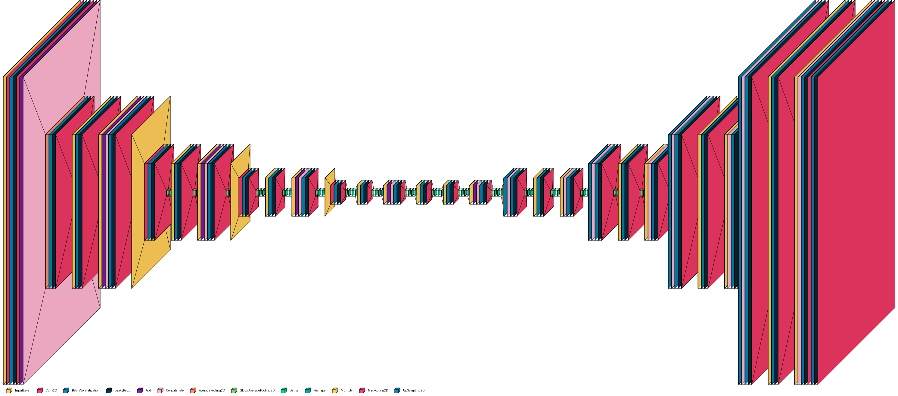
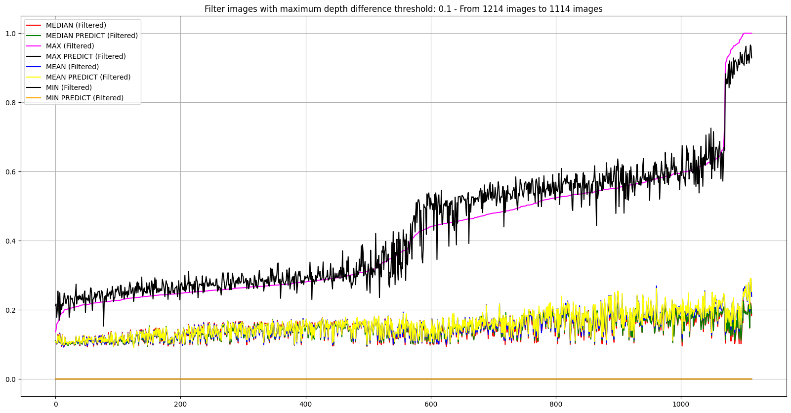

<h1>Depth Estimation</h1>

## Ước tính khoảng cách từ camera đến các vật thể trong ảnh
## Estimate the distance from the camera to objects in the image

<h2>Kiến trúc mô hình - Models architecture</h2>
  
1.  **Convolutional Autoencoder (CAE) backbone [ResNet](https://arxiv.org/abs/1512.03385)**
  

2.  **U-net backbone [ResNet](https://arxiv.org/abs/1512.03385)**

3.  **U-net backbone kết hợp [ResNet](https://arxiv.org/abs/1512.03385) & [DenseNet](https://arxiv.org/abs/1608.06993)**

4. **Unet SE resnet-dense (light - 3M)**

5. **Unet SE resnet-dense (light - 7M)**

6. **Unet SE resnet-dense (medium - 13M)**

- backbone:
    + se block
    + conv_se_block
    + densenet-resnet block
    + attention block

## Evalute model 6

