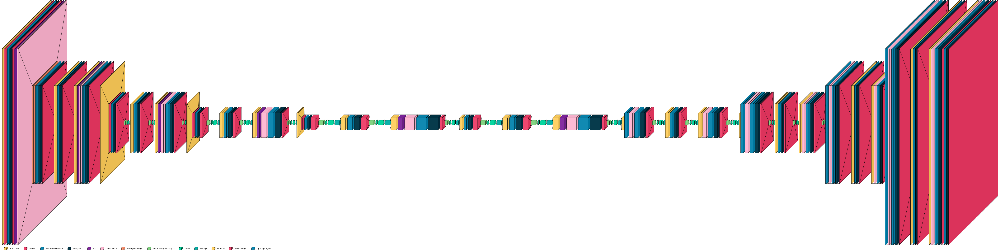

<h1>Depth Estimation</h1>

## Ước lượng độ sâu
Kỹ thuật này tính toán khoảng cách từ cảm biến (thường là camera) đến từng điểm hoặc đối tượng hiện hữu trong một khung cảnh quan sát được. Thông qua việc hồi quy giá trị độ sâu cho mỗi điểm ảnh.

## Mục tiêu chính
Thay thế các thiết bị đo độ sâu chuyên dụng (LiDAR, PrimeSense Carmine sensor, ..) bằng các phương pháp huấn luyện mô hình học sâu dựa trên CNNs  

## Ứng dụng

1. Xe tự hành (sử dụng dữ liệu độ sâu từ các cảm biến để xây dựng mô hình 3D chi tiết của môi trường xung quanh xe, kết hợp với các biện pháp xác định vị trí các đối tượng trong ảnh RGB từ đó xác định khoảng cách khi có vật đến gần để xe vận hành tự động)
   

2. Tái tạo 3D
   

<h2>Phương pháp</h2>
  
1.  **Convolutional Autoencoder (CAE) backbone [ResNet](https://arxiv.org/abs/1512.03385)**
  

2.  **U-net backbone [ResNet](https://arxiv.org/abs/1512.03385)**

3.  **U-net backbone kết hợp [ResNet](https://arxiv.org/abs/1512.03385) & [DenseNet](https://arxiv.org/abs/1608.06993)**

4. **Unet SE resnet-dense (light - 3M)**

5. **Unet SE resnet-dense (light - 7M)**

6. **Unet SE resnet-dense (medium - 13M)**

